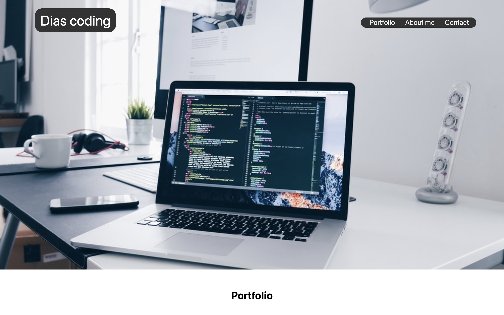

### Alexei Dias Portfolio
--------------------
######  This is a very special project to me. I Highlights the the how much i have learned in so little time. I consider it to be an organic project since i will be improving it as i gain more knowledge and experience. I tried to keep the desingn simple, the  one page format makes easy to navigate. 

##### 100% BOOTSTRAP FREE!!!
##### Its hard to ignore the importance of Bootstrap framework, but i decided to face the challenge and made the project 100% BOOTSTRAP FREE!!!

###### Ther is some touch ups that i need to work on. On the Contacts area at the footer the FaceBook link needs to be updated, right now is linked to an unrelated page. The email link is setup to use the default email service been used by the device. The LinkeIn button is not linked to anything yeat. It will be working soon.

### Future implementations.

* Smooth scrolling
* Webpage visitors count using Firebase

------

---

## Technologies usen on the project
* Github
###### Github is a remote repository where we can store versions of our code.
* Gitlab
###### GitLab is a web-based DevOps lifecycle tool that provides a Git-repository manager providing wiki, issue-tracking and CI/CD pipeline features, using an open-source license, developed by GitLab Inc.
* HTML 5
###### HTML is a markup language tool where we write the text of our webpages. It Uses tags to organize the page in a  semantic meaning. Making easer to read and understand de structure of the page.
* JavaScript
###### JavaScript, often abbreviated as JS, is a high-level, interpreted scripting language that conforms to the ECMAScript specification. JavaScript has curly-bracket syntax, dynamic typing, prototype-based object-orientation, and first-class functions.
* Bootstrap
###### The world’s most popular framework for building responsive, mobile-first sites.
---
> Author
 Alexei Dias
 Linkedin 
 https://www.linkedin.com/in/alexei-dias-b4054a164/